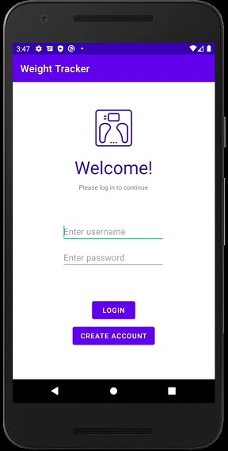
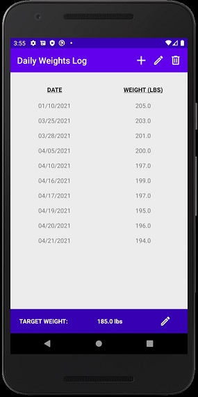
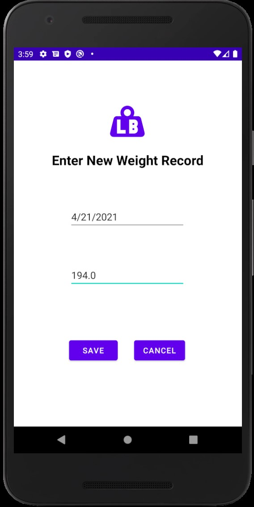
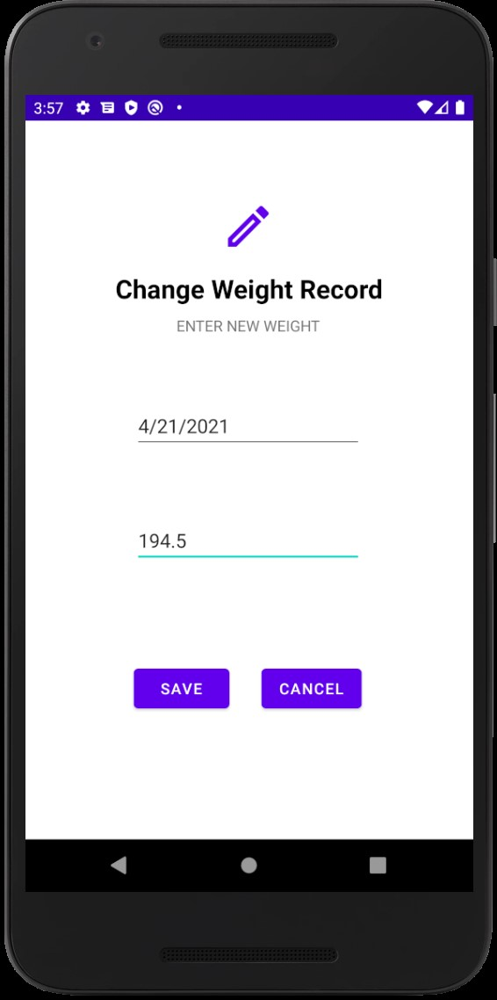
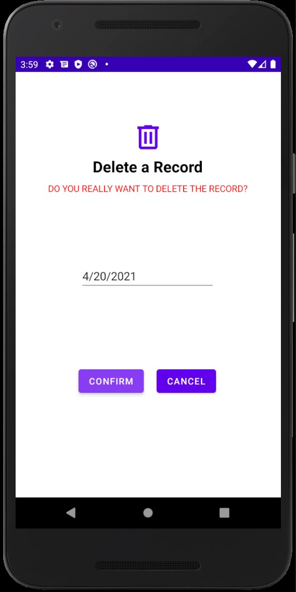
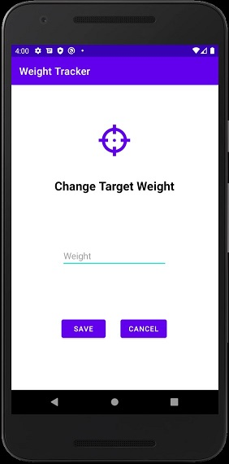

# About the Project
Weight Tracker is a weight watching mobile application for Android
devices. The user can log daily weights in a list format and the app
will notify the user when they have reached a target weight. Having a
useful list of past records will help users reach their weight goals.

# Motivation
I am always eager to improve my health physically and mentally. When I
was required to develop an Android app for school, I saw a way to help
others in achieving good health. If this app helps just one person
to be more motivated or healthy, I will consider the project
a success.

# Screenshots

 

 

 

# Features
1. Sends a text message notification to the user's device when the
target weight is reached
2. Stores user's weights in a nonvolatile SQLite database
3. Supports multiple user accounts on one device

# Tools Used
1. Java
2. Android Studio
3. SQLite Room Database

# Requirements
Currently supported Android versions include 10, 9, and 8.1.0. Device
must be an Android phone or tablet. To receive text message
notifications, device must have messaging and phone capabilities.